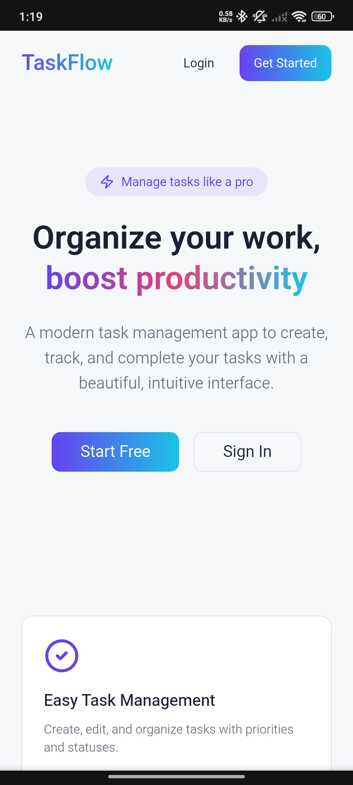
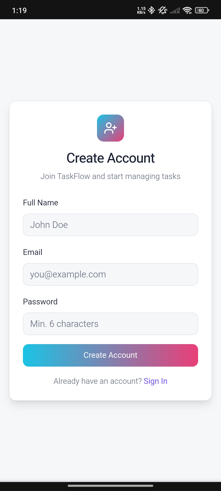
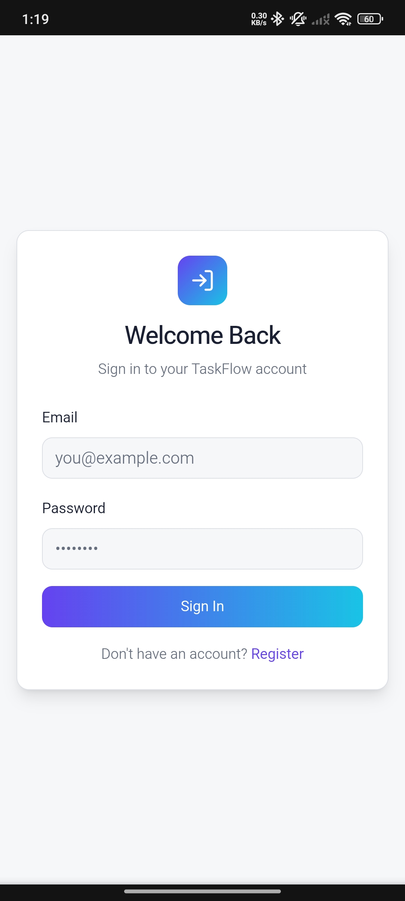
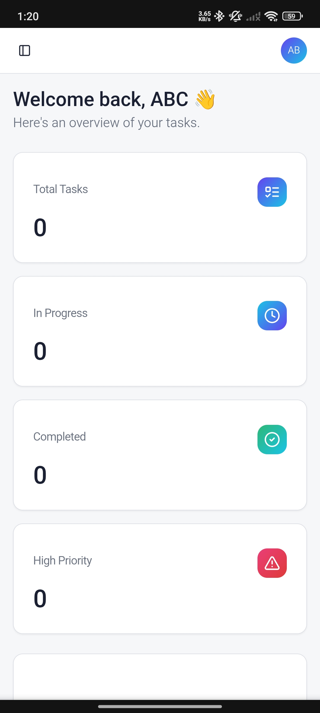
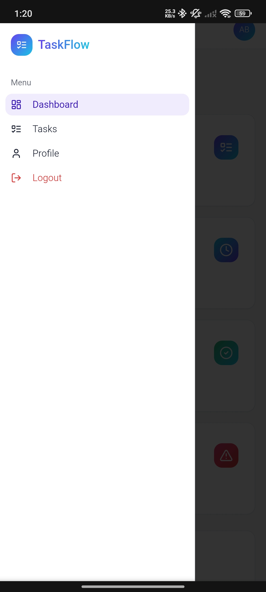

# 🚀 Modern Task Management

Modern Task Management is a responsive and user-friendly task management web application that helps users organize, track, and manage daily tasks efficiently.

It features secure authentication, real-time task updates, and a clean dashboard interface designed for productivity.

🔗 **Live Demo:** https://modern-task-management.vercel.app

---

## ✨ Features

✅ User Authentication (Register & Login)  
✅ Secure session management  
✅ Create, edit, and delete tasks  
✅ Task status & priority tracking  
✅ Real-time updates & notifications  
✅ Protected dashboard routes  
✅ Profile management  
✅ Responsive & mobile-friendly design  
✅ Clean & modern UI  

---

## 🖼️ App Preview

### 🏠 Home Page


### 📝 Register Page


### 🔐 Login Page


### 📊 Dashboard Overview


### 📂 Sidebar Navigation


---

## 🛠️ Tech Stack

### Frontend
- ⚛️ React + TypeScript
- ⚡ Vite
- 🎨 Tailwind CSS
- 🧩 shadcn/ui

### Backend & Database
- 🗄️ Supabase (Auth + Database)
- 🔐 Row Level Security (RLS)

### Libraries & Tools
- React Router
- React Query
- ESLint
- Toast Notifications

---

## 📂 Project Structure
---

## ⚙️ Installation & Setup

### 1️⃣ Clone Repository

```bash
git clone https://github.com/YOUR_USERNAME/modern-task-management.git
cd modern-task-management
